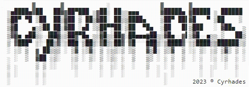

# CTF Stéganographie - Fusion de pixels

## Présentation du CTF 
**ID** 8 dans **les CTFs de Cyrhades**

La stéganographie est la pratique de dissimulation d'informations dans un autre message ou un objet physique pour éviter que celles-ci soient détectées. La stéganographie peut être utilisée pour cacher pratiquement tout type de contenu numérique, y compris du texte, des images, des vidéos ou du contenu audio.

Dans cet exercice il y a 2 images fusionnées ! Arriverez vous à trouver le flag ?

## Aperçu

-----------

## Installation manuel
Vous n'utilisez pas l'application **les CTFs de Cyrhades** ? C'est dommage !
Mais voici comment télécharger ce CTF manuellement :

> git clone https://github.com/Hack-Oeil/STEGANO_EXERCICE_3.git

